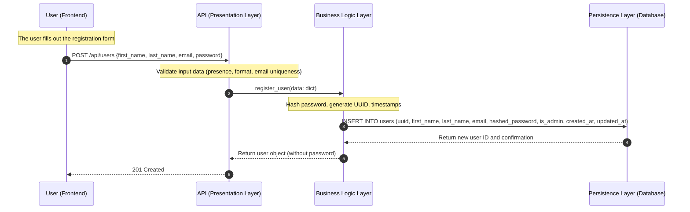
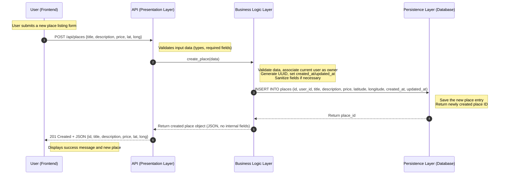
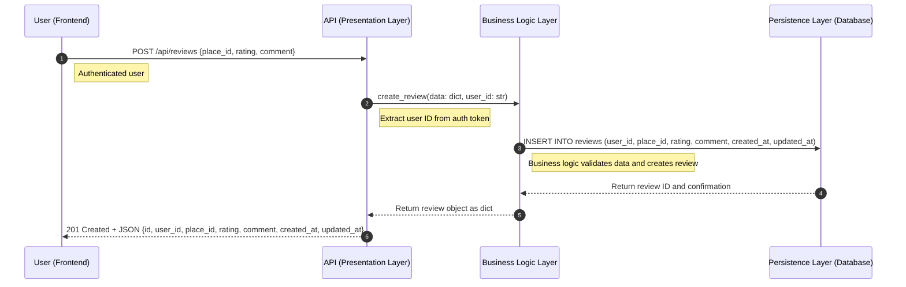
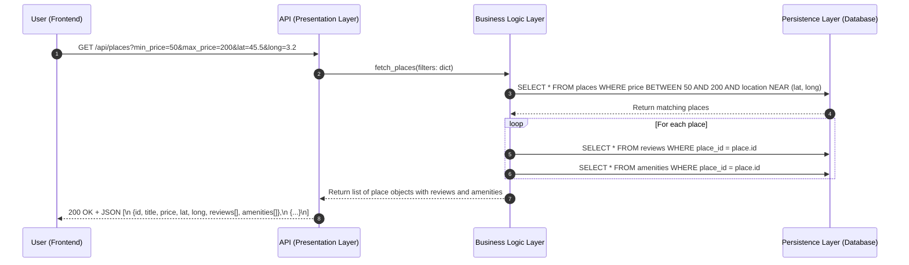

# HBnB – Technical Documentation

This document serves as the foundation for the development of the HBnB Evolution project. It compiles all technical diagrams and design decisions made during the first part of the project, helping developers and collaborators understand the overall architecture, business logic, and flow of interactions within the system.

---

## 📘 Introduction

**HBnB Evolution** is a simplified AirBnB-like application. It allows users to:

* Register and manage user profiles
* Create and list properties (places)
* Submit reviews for visited places
* Associate places with amenities (features)

This document presents the full architectural overview, including:

* The layered system design using the facade pattern
* Business entities and their relationships
* The interaction flow for core API operations
---
## 🧱 High-Level Architecture – Package Diagram

---

---

## 🏛️ Class diagram

### ✅ Entity Descriptions

* **User**: A person using the platform. Can register, update profile, and own places.
* **Place**: A property listed by a user. Linked to reviews and amenities.
* **Review**: Feedback from a user for a place, with rating and comment.
* **Amenity**: Features linked to places (WiFi, pool, etc.)

---

## 🔁 Sequence Diagrams – API Interaction Flow

### 1. User Registration

**Description**: User sends registration data → API → Service → Repository → Confirmation response.

---

### 2. Place Creation

**Description**: User submits place info → API → PlaceService → DB → response

---

### 3. Review Submission

**Description**: Review submission goes through API and is saved after validation.

---

### 4. Fetching a List of Places

**Description**: User asks for places → filters applied → DB queried → results returned

---

## ✅ Final Notes

This document covers the full technical blueprint of the HBnB application's architecture. It includes:

* A layered structure using the facade pattern
* Clear responsibilities between models, services, and data access
* Visual sequence flows for major use cases

This file should be kept updated as development progresses in the next phases.
