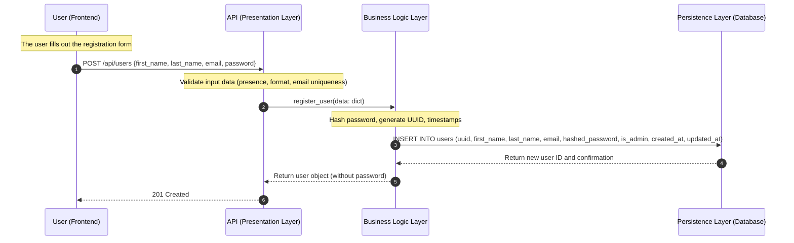
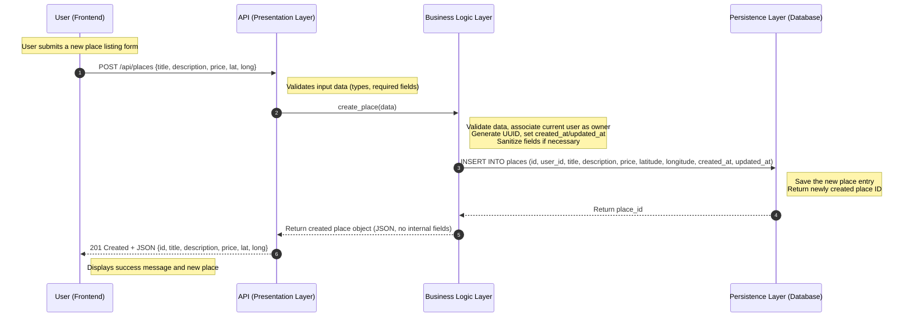
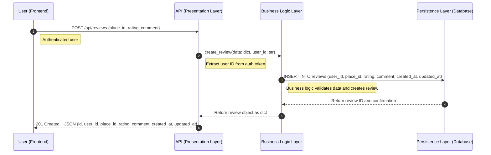
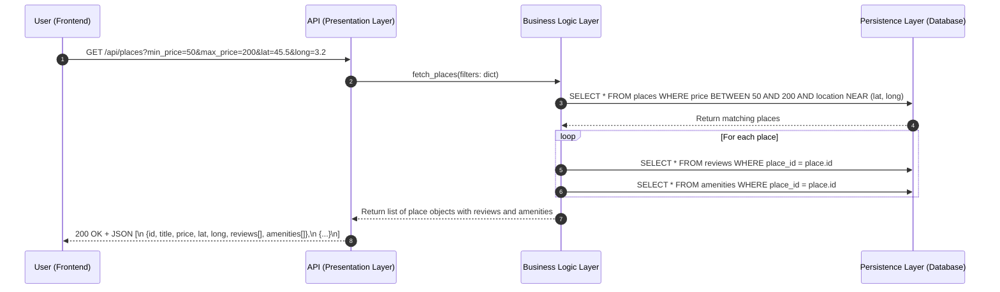

# Sequence Diagrams for API Calls

## Explanatory Notes

These sequence diagrams illustrate how the system components interact to perform key operations through the API. Each scenario involves communication between the frontend (Client), the Presentation Layer (API), the Business Logic Layer (Logic), and the Persistence Layer (Database).

---

### 1. **User Registration**

**Description**: Handles user signup by validating input, hashing passwords, storing user data, and returning a clean response.

---

### 2. **Place Creation**

**Description**: Allows a user to create a new place listing, validating and storing the data before returning the created object.

---

### 3. **Review Submission**

**Description**: Submits a review for a place. The system ensures proper authorization and stores the review data.

---

### 4. **Fetching a List of Places**

**Description**: Retrieves a list of places filtered by criteria, including nested data like reviews and amenities for each place.

