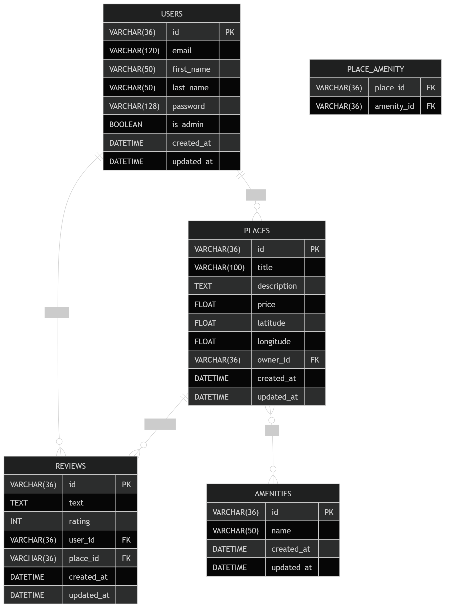

# HBnB Evolution - Airbnb Clone Project

A comprehensive learning project from Holberton School that implements a simplified Airbnb-like web application with a focus on architecture, design patterns, and backend development.

---

## 📋 Project Overview

**HBnB Evolution** is a full-stack web application that demonstrates professional software architecture and development practices. The project is divided into three progressive phases:

* **Part 1**: Design & Architecture (UML diagrams, system design)
* **Part 2**: Backend Implementation (API development)
* **Part 3**: Advanced Features (database integration, repositories, facade pattern)

---

## 🎯 Core Features

The platform enables users to:

* ✅ **Register and manage user profiles**
* ✅ **Create and list properties**
* ✅ **Submit and read reviews**
* ✅ **Associate amenities with properties**
* ✅ **Manage user data**

---

## 🏗️ Architecture

The application follows a **3-Layer Architecture** with the **Facade Pattern**:

```
┌─────────────────────────────┐
│   Presentation Layer (API)  │  ← REST endpoints, request handling
├─────────────────────────────┤
│  Business Logic Layer       │  ← Core business rules, validation
├─────────────────────────────┤
│   Persistence Layer (DB)    │  ← Data storage and retrieval
└─────────────────────────────┘
```

### Core Entities

| Entity      | Description                                                          |
| ----------- | -------------------------------------------------------------------- |
| **User**    | Platform users who can register, manage profiles, and own places     |
| **Place**   | Property listings with details (title, description, price, location) |
| **Review**  | User feedback on places with ratings and comments                    |
| **Amenity** | Features/services available at properties (WiFi, pool, etc.)         |

---

## 🔄 API Endpoints

### Users (`/api/v1/users`)

| Method | Endpoint     | Description                             | Auth |
| ------ | ------------ | --------------------------------------- | ---- |
| GET    | `/`          | Get all users                           | No   |
| POST   | `/`          | Create a new user (public registration) | No   |
| GET    | `/<user_id>` | Get user by ID                          | No   |
| PUT    | `/<user_id>` | Update user (self only)                 | Yes  |
| POST   | `/login`     | User login                              | No   |

### Amenities (`/api/v1/amenities`)

| Method | Endpoint        | Description                       | Auth |
| ------ | --------------- | --------------------------------- | ---- |
| GET    | `/`             | Get all amenities                 | No   |
| POST   | `/`             | Create a new amenity (admin only) | Yes  |
| GET    | `/<amenity_id>` | Get amenity by ID                 | No   |
| PUT    | `/<amenity_id>` | Update amenity (admin only)       | Yes  |

### Places (`/api/v1/places`)

| Method | Endpoint              | Description                 | Auth |
| ------ | --------------------- | --------------------------- | ---- |
| GET    | `/`                   | Get all places              | No   |
| POST   | `/`                   | Create a new place          | Yes  |
| GET    | `/<place_id>`         | Get place by ID             | No   |
| PUT    | `/<place_id>`         | Update place (owner only)   | Yes  |
| GET    | `/<place_id>/reviews` | Get all reviews for a place | No   |

### Reviews (`/api/v1/reviews`)

| Method | Endpoint       | Description                | Auth |
| ------ | -------------- | -------------------------- | ---- |
| GET    | `/`            | Get all reviews            | No   |
| POST   | `/`            | Create a new review        | Yes  |
| GET    | `/<review_id>` | Get review by ID           | No   |
| PUT    | `/<review_id>` | Update review (owner only) | Yes  |
| DELETE | `/<review_id>` | Delete review (owner only) | Yes  |

---

## 🔐 Authentication

* JWT (JSON Web Token) based authentication.
* `access_token` returned on login.
* Admin privileges required for certain endpoints (`amenities POST/PUT`).
* User ownership required for updating/deleting places or reviews.

---

## 🛠️ Technology Stack

* **Backend Framework**: Flask (Python)
* **Database**: Relational Database (SQLite/MySQL/PostgreSQL)
* **Authentication**: JWT/Session-based
* **API Standard**: REST
* **Architecture Pattern**: 3-Layer + Facade Pattern
* **ORM**: SQLAlchemy

---

## 🏗️ Project Structure

```
.
├── app/
│   ├── api/
│   │   └── v1/
│   │       ├── amenities.py
│   │       ├── places.py
│   │       ├── reviews.py
│   │       └── users.py
│   ├── models/
│   │   ├── amenity.py
│   │   ├── basemodel.py
│   │   ├── place.py
│   │   ├── review.py
│   │   └── user.py
│   ├── persistence/
│   │   └── repository.py
│   └── services/
│       ├── facade.py
│       └── repositories/
│           ├── amenity_repository.py
│           ├── place_repository.py
│           ├── review_repository.py
│           └── user_repository.py
├── docs/
│   └── hbnb_er_diagram.png
├── test_models/
│   └── tests for models
├── config.py
├── requirements.txt
├── run.py
├── schema.sql
├── seed.sql
└── README.md
```

---

## 📄 ER Diagram



---

## 🚀 Getting Started

1. Clone the repo:

```bash
git clone https://github.com/haitham71/hbnb-evolution.git
cd hbnb-evolution
```

2. Create a virtual environment and install dependencies:

```bash
python -m venv venv
source venv/bin/activate  # Linux/Mac
venv\Scripts\activate     # Windows
pip install -r requirements.txt
```

3. Set environment variables:

```bash
export FLASK_APP=run.py
export FLASK_ENV=development
export SECRET_KEY=your_secret_key
export JWT_SECRET_KEY=your_jwt_key
```

4. Initialize database:

```bash
# For SQLite
flask shell
>>> from app.models.basemodel import db
>>> db.create_all()
```

5. Run the server:

```bash
flask run
```

6. Access API at: `http://localhost:5000/api/v1/`

---

## 👥 Development Team

| Developer | GitHub                                     |
| --------- | ------------------------------------------ |
| Haitham   | [@haitham71](https://github.com/haitham71) |
| Abdullah  | [@AXA6](https://github.com/AXA6)           |
| Mustafa   | [@i1SaSa](https://github.com/i1SaSa)       |

---

## 📄 License

This project is part of the Holberton School curriculum.
